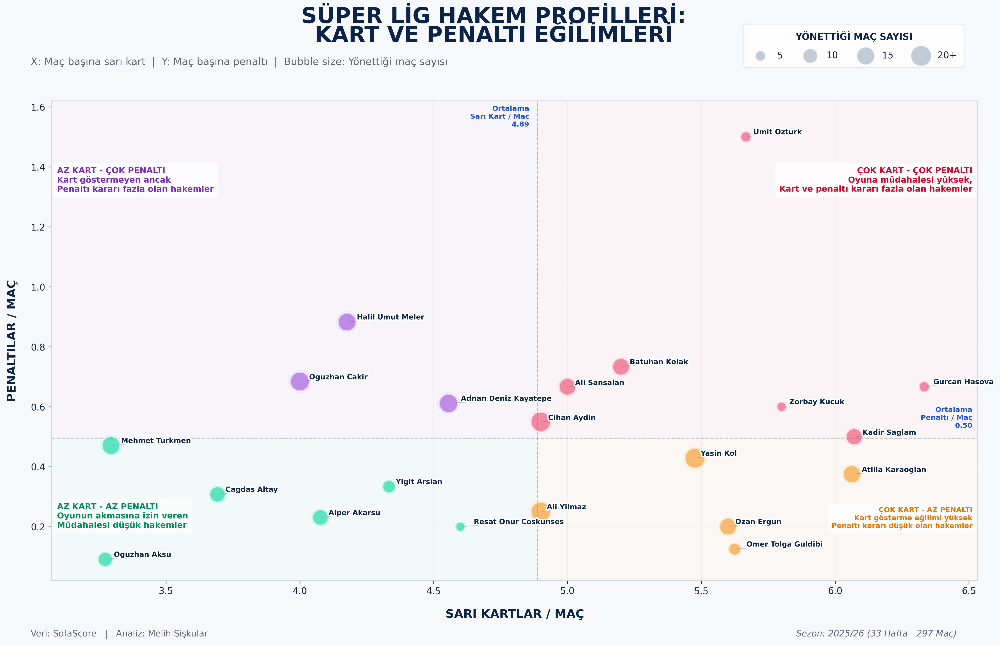
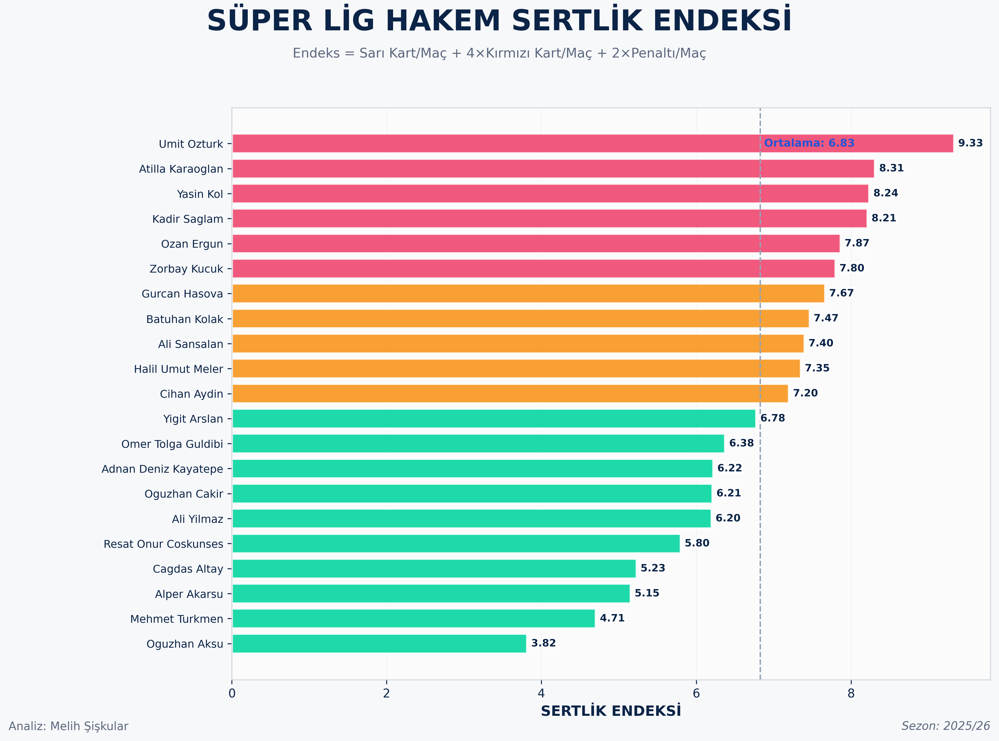
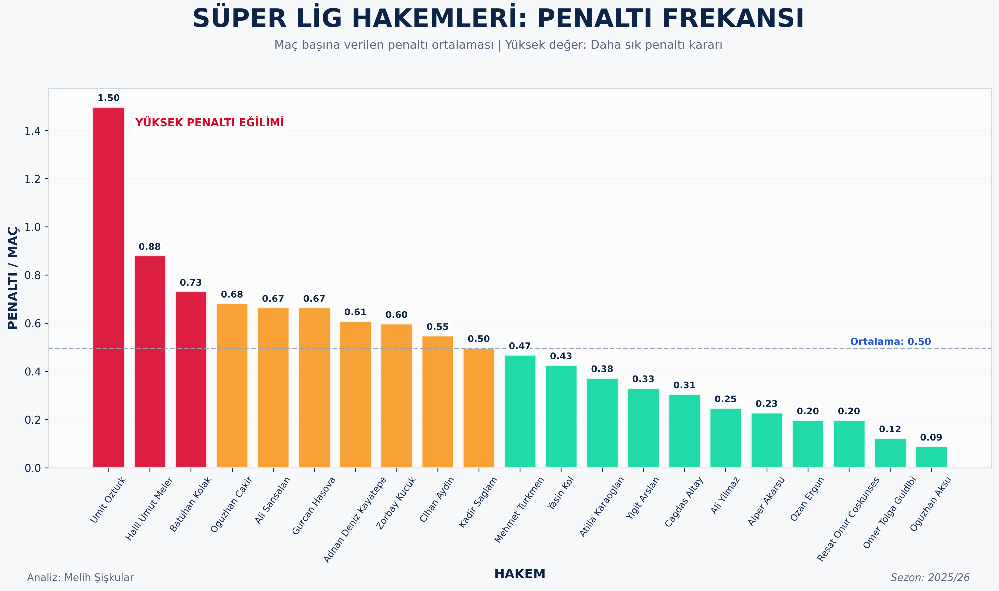
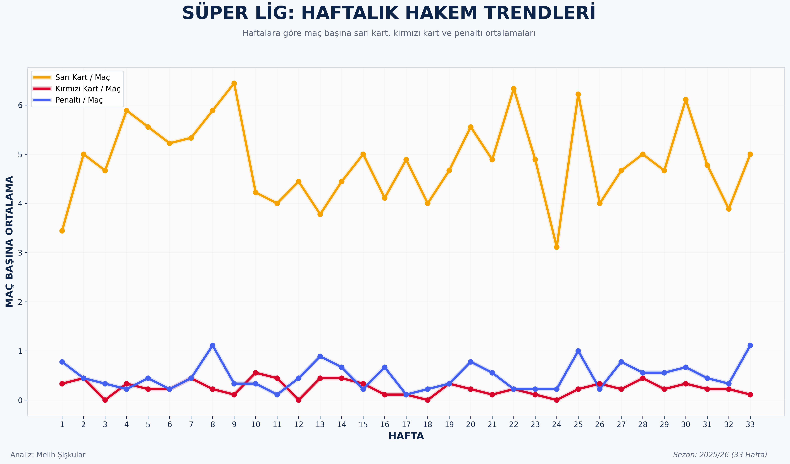
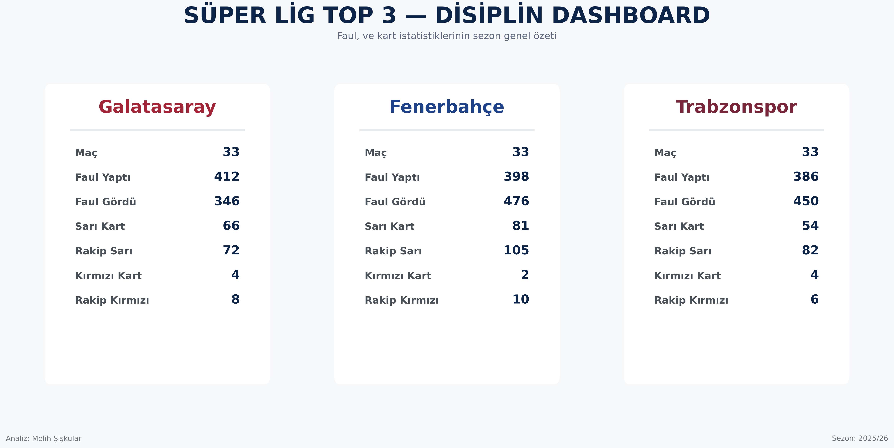
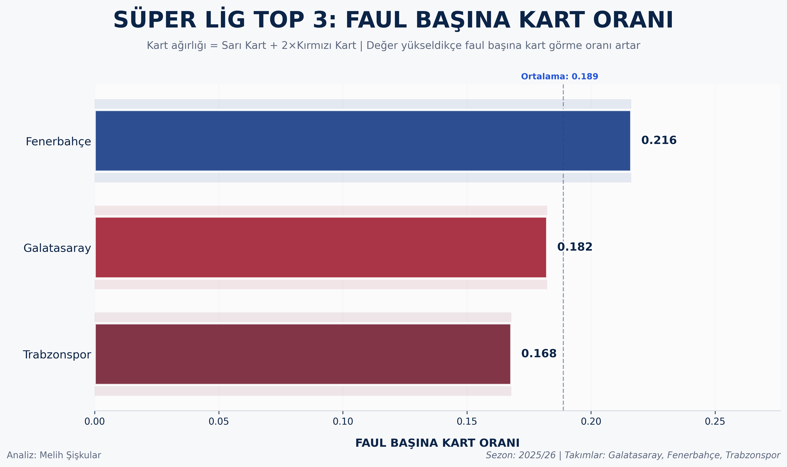
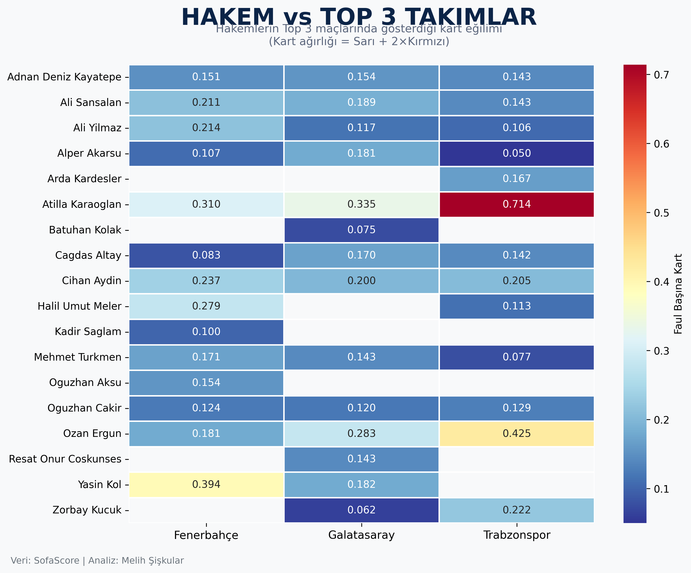

# Süper Lig Referee Analysis (2025/26)

A football referee analysis project focused on the Turkish Süper Lig 2025/26 season.

The project explores referee tendencies, discipline metrics, penalty frequency, weekly trends, and team-based disciplinary profiles using Python and football match data.

---

## Tools & Libraries

- Python
- pandas
- matplotlib
- seaborn
- NumPy

Data visualization and analysis were inspired by editorial-style football analytics dashboards.

---

## Included Analyses

- Referee Strictness Index
- Penalty Frequency Analysis
- Yellow vs Red Card Profiles
- Weekly Referee Trends
- Top 3 Team Discipline Dashboard
- Referee vs Team Heatmaps
- Cards per Foul Analysis

---

## Sample Visualizations



---



---



---



---



---



---



---

##  Important!

```md id="f4hmx6"
## Notes

Raw datasets and scraping pipelines are not fully included in this repository.
The project is shared primarily for visualization, analytical methodology, and portfolio purposes.

```

# AUTHOR
#### - Melih Şişkular
